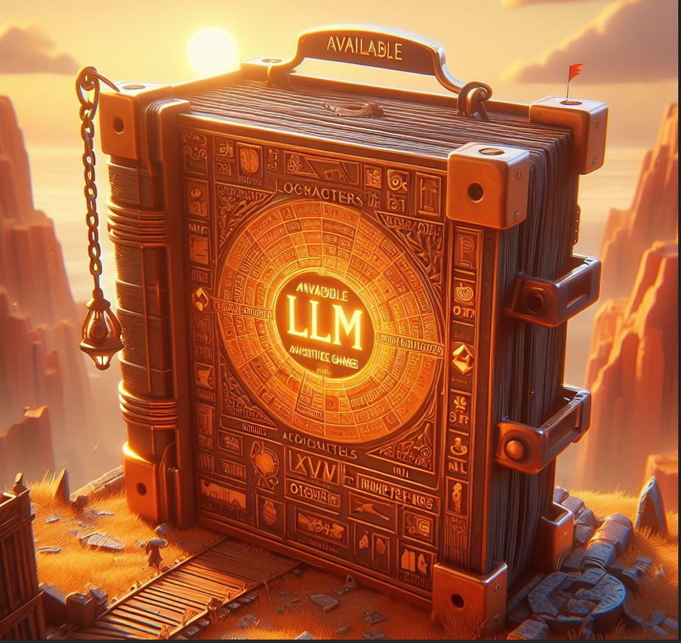
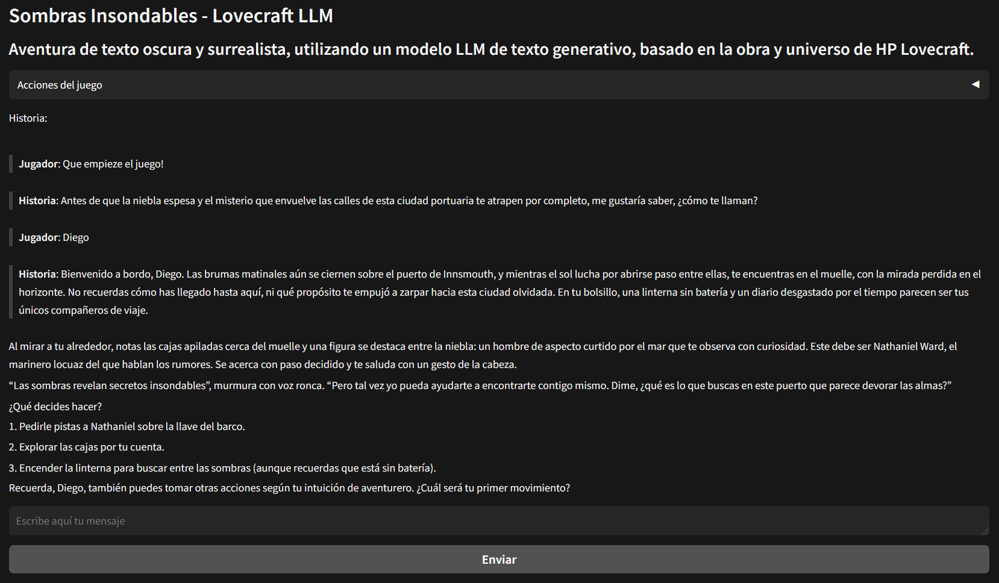

# llm-adventure-games

El repositorio alberga maquetas de MVP disponibles y juegos de aventuras que emplean modelos de LLM como su motor de juego. Estos juegos están fundamentados en un conjunto de reglas, personajes, ubicaciones y acertijos, todos definidos dentro de un documento de prompteo.

Actualmente, el repositorio cuenta con un juego, pero la diversidad de juegos continuará expandiéndose a medida que se generen nuevos prompteos y se experimente con diferentes formas de juego. Este proyecto no solo se centra en la creación de juegos, sino que también forma parte de un proceso de experimentación con estos modelos, con el objetivo de aprender las bibliotecas necesarias para plasmar ideas y juegos a través de esta tecnología. Además, se busca optimizar la utilización de las librerías para el manejo de modelos de LLM, así como explorar nuevas posibilidades para la creación de interfaces visuales en este contexto.

## Requerimientos

Si bien se está sumando un servidor para jugar directamente online, por el momento se puede jugar de forma local descargando el repositorio e instalando las dependencias.

- Utiliza Python 3.11+, langchain, gradio y modelos de OpenAI.

- Dependencias en el requirements.txt (openai, langchain, gradio, python-dotenv)

## To-Do's:

- [ ] Pruebas con diferentes modelos aparte de OpenAI haciendolo agnostico frente al tipo de modelo, priorizando modelos abiertos

- [ ] Pruebas con openllm deploy para publicar sobre nubes que soporten modelos abiertos

- [ ] Pruebas con llamafile. Langchain + api endpoint localserver de llamafile 

# Juegos 

## Lovecraft LLM: Sombras Insondables.

Aventura de texto oscura y surrealista, utilizando un modelo LLM de texto generativo, basado en la obra y universo de HP Lovecraft.

- Prompt : https://github.com/vlasvlasvlas/llm-adventure-games/blob/main/prompts/lovecraft_prompt.md
- Cli version : https://github.com/vlasvlasvlas/llm-adventure-games/tree/main/01-lovecraftworld-game-cli
- Web version : https://github.com/vlasvlasvlas/llm-adventure-games/tree/main/01-lovecraftworld-game-web

